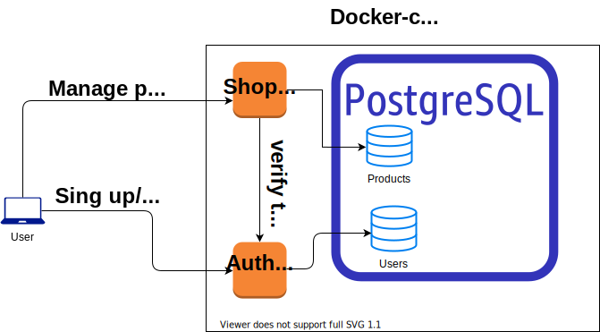

# Интернет магазин
Базовый API для интернет магазина

## Архетиктура системы
<object data='https://pastebin.com/raw/Kt46pCSG' type='image/svg'></object>



## Методы REST API
Должны быть реализованые следующие методы:
* добавить новый товар;
* редактировать товар по `id`;
* удалить товар по `id`;
* получить определенный товар по `id`;
* получить полный список товаров.

Swagger схема находится на http://127.0.0.1:8081/swagger

Данные между версиями не синхронизируются и хранятся независимо. В дальнейшем первая версия развиваться не будет, перейдет на `/products/v1/...`, вторая версия будет базовой и переедет на `/products/...`

## Товар
Описание товара состоит из:
- названия;
- уникального кода (`id`)
- категории число или название

## Запуск
Для запуска требуется собрать докер образ и запустить через `docker-compose`

```
cd shop-systems
docker-compose up --build
```
