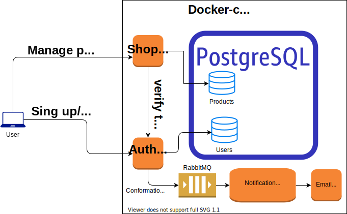

# Интернет магазин
Базовый API для интернет магазина

## Архетиктура системы
<object data='https://pastebin.com/raw/Kt46pCSG' type='image/svg'></object>



## Описание системы
Swagger схема находится на http://127.0.0.1:8081/swagger

### Продуктовый сервис
Реализованые следующие методы работы с товарами:
* добавить новый товар;
* редактировать товар по `id`;
* удалить товар по `id`;
* получить определенный товар по `id`;
* получить полный список товаров.

Для первых трех методов (любое изменение товара) требуется access-token из сервиса авторизации.

#### Товар
Описание товара состоит из:
- названия товара
- уникального кода (`id`)
- названия категории

### Сервис авторизации
Реализованы следующие методы для авторазции/аутентификации:
* регистрация по почте
* вход в аккаунт
* обновление токенов для работы
* проверка токена на валидность
* подтверждение регистрации нового пользователя

После регистрации на почту приходит письмо (в текущей настройке `docker-compose` письмо приходит в mock smpt-сервиса) со ссылкой на подтверждение учетной записи.
Вход в аккаунт возможен только после его подтверждения (при попытке приходит новое письмо). 

## Установка и запуск
При запуске через `docker-compose` нужные образы соберутся автоматически и необходимые сервисы поднимуться

```
git clone --recursive https://github.com/asanikushin/shop-systems.git
cd shop-systems
docker-compose up --build
```
